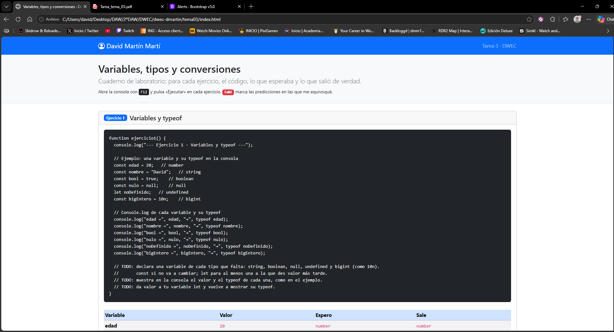
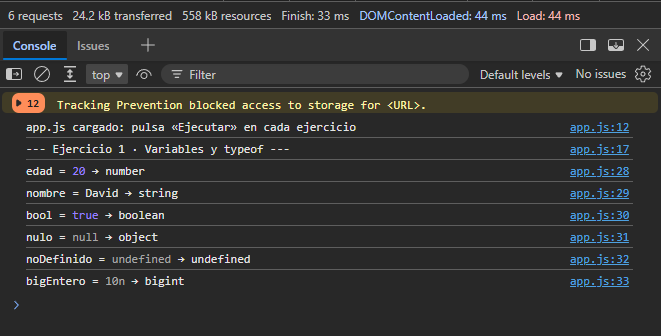
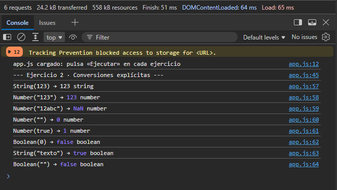
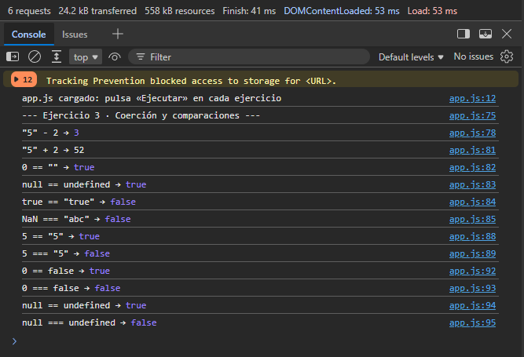
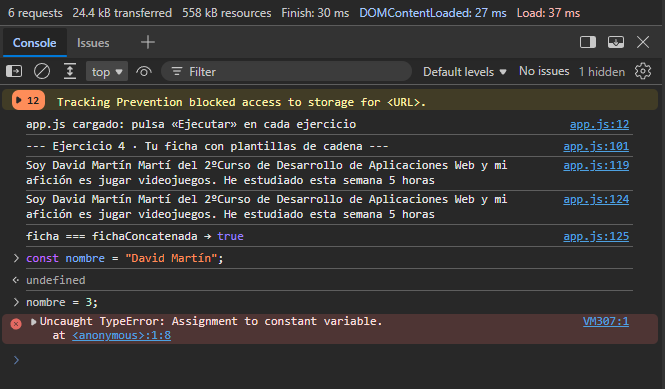

# Tarea 3 · Variables, tipos y conversiones

**Autor:** David Martín Martí · Desarrollo Web en Entorno Cliente (DWEC) · 2.º DAW · Curso 2026-27

Esta carpeta contiene una página con Bootstrap 5 (`index.html`) y su JavaScript (`js/app.js`), con cuatro ejercicios: variables y `typeof`, conversiones explícitas, coerción y comparaciones, y una ficha personal con plantillas de cadena. Para probarla: abrir la carpeta en VS Code, pulsar **Go Live**, abrir la consola con F12 y pulsar «Ejecutar» en cada ejercicio. Cada card muestra el código, una tabla con lo que esperaba y lo que salió de verdad, y la etiqueta **Fallé** en las predicciones que no acerté.

## Capturas

### a) La página entera

Se ve mi nombre («David Martín Martí») en la navbar, la cabecera y las cuatro cards, una por ejercicio, con su código, su tabla y su botón «Ejecutar». Las predicciones fallidas aparecen marcadas con la etiqueta roja **Fallé**: una en el ejercicio 1, una en el 2 y tres en el 3.

### b) Consola del ejercicio 1

La consola muestra el valor y el `typeof` de seis variables: `number`, `string`, `boolean`, `undefined` y `bigint`, y el caso curioso de `null`, que devuelve `object`. Fue la única predicción que fallé en este ejercicio.

### c) Consola del ejercicio 2

La consola muestra el resultado y el tipo de ocho conversiones explícitas con `String()`, `Number()` y `Boolean()`. La que me sorprendió fue `Number("12abc")`, que da `NaN` en lugar del `12` que esperaba.

### d) Consola del ejercicio 3

La consola muestra las expresiones que mezclan tipos y las parejas comparadas con `==` y con `===` (`5` y `"5"`, `0` y `false`, `null` y `undefined`). Fallé tres: `null == undefined` (dos veces) y `true == "true"`.

### e) Consola del ejercicio 4, con el error de la const

La consola muestra mi ficha construida con plantilla de cadena y con concatenación, y la comparación `ficha === fichaConcatenada` con resultado `true`. También se ve el error `Uncaught TypeError: Assignment to constant variable.`, que sale al intentar darle otro valor a una `const` desde la consola del navegador.

## Reflexión

Lo más intuitivo fueron las conversiones «con sentido»: `Number("123")` da `123`, `Number(true)` da `1`, `Boolean(0)` y `Boolean("")` dan `false`, y `"5" - 2` da `3` mientras que `"5" + 2` da `"52"` (la resta siempre convierte a número y el `+` con una cadena concatena). Me sorprendieron cinco cosas, y por eso tengo cinco **Fallé** en las tablas. Primero, `typeof null` devuelve `object`, un error histórico del lenguaje que no se corrige para no romper webs antiguas. Segundo, `Number("12abc")` da `NaN`: convierte la cadena entera o no convierte nada. Tercero, `null == undefined` da `true` pero `null === undefined` da `false`, y me equivoqué en esto dos veces. Cuarto, `true == "true"` da `false`, porque `true` pasa a `1` y `"true"` pasa a `NaN`. Me quedo con que `==` hace conversiones que no siempre se adivinan, y que `===` es más predecible porque no convierte nada.

## Fuentes

- [Alerts · Bootstrap v5.0](https://getbootstrap.com/docs/5.0/components/alerts/)

## Uso de IA

He usado Claude (Anthropic) para redactar este README a partir del guion de la plantilla, de mi código y de mis tablas de predicciones. Después revisé el texto, comprobé que coincidía con lo que sale en mi consola y corregí lo que no cuadraba.

También he usado Gemini 3.6 Flash para responder a ciertas preguntas de los ejercicios, como el caso del typeof null o para el error de cambiar constante.
